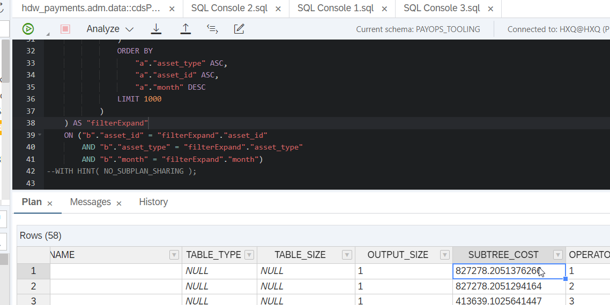
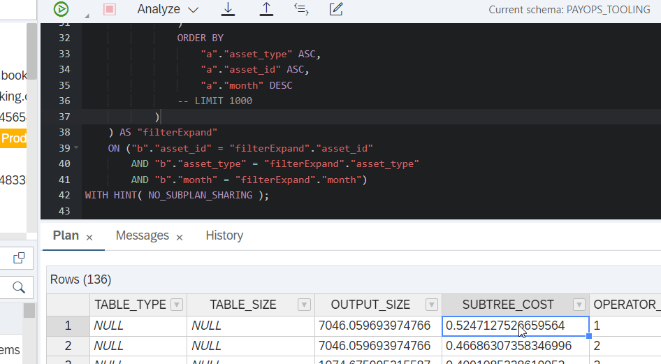

# cap-limit-issue-example

Here is the problem definition. If we send request like this via graphQL:

```gql
query {
  TravelService{
    Travel(top:100){
      nodes{
        TravelID       
        to_Booking{
          nodes {
            BookingID            
          }
        }
      }
    }
  }
}
```

we may see that it leads to two SQL requests:
```sql
SELECT
    b.BookingID AS "b_BookingID",
    b.to_Travel_TravelUUID AS "b_to_Travel_TravelUUID",
    b.BookingUUID AS "b_BookingUUID",
    filterExpand.TravelUUID AS "filterExpand_TravelUUID"
FROM
    localized_TravelService_Booking b
    INNER JOIN (
        SELECT
            DISTINCT TravelUUID
        FROM
            (
                SELECT
                    a.TravelUUID AS TravelUUID
                FROM
                    localized_TravelService_Travel a
                ORDER BY
                    a.TravelUUID COLLATE NOCASE ASC
                LIMIT
                    100 OFFSET 0
            )
    ) filterExpand ON (
        filterExpand.TravelUUID = b.to_Travel_TravelUUID
    )
```

and 

```sql
SELECT
    a.TravelID AS "a_TravelID",
    a.TravelUUID AS "a_TravelUUID"
FROM
    localized_TravelService_Travel a
ORDER BY
    a.TravelUUID COLLATE NOCASE ASC
LIMIT
    100 OFFSET 0
```

The problem is - that Hana database goes quite wild with this first request having LIMIT in the subselect.

Here are approximate costs we face for the real-world example and the result when we remove nested limit




